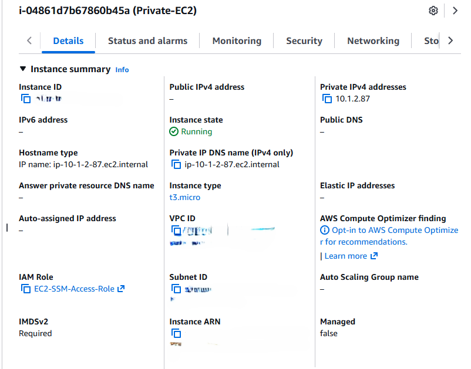
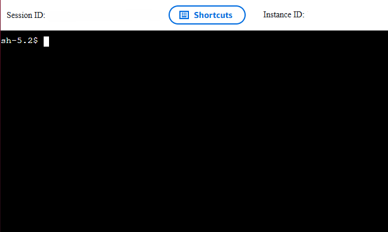

# AWS Private Subnet & Secure Access Lab

This lab focuses on deploying workloads in private subnets and implementing secure,
IAM-based access using AWS Systems Manager instead of SSH.

## Screenshots

